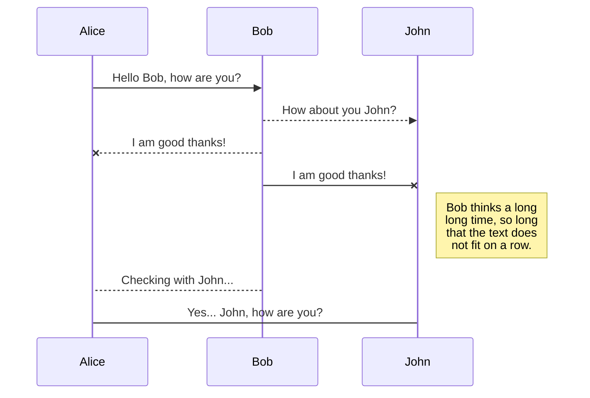

# RailsGilrsWithB

## やりたいことリスト

### 改善案のアイディアを管理するアプリ

- [ ] みんなが出したアイディアを整理する
- [ ]  誰が発案したか
- [ ] どんなアイディアかタイトル、詳細
- [ ] どんなべねふぇいっとがあるか
- [ ] 誰にベネフィットがあるか？
- [ ] アイディアは動きだしているか？
- [ ] アイディアは形になった？まぁ諦めてもいいけど終わった？

### コーヒー当番みえる化

今日のバリスタさんは誰？

### KY君

- 空気読める君
- 温度や湿度、PM0.25などを自動検知してお知らせ

### 挨拶ダッシュ

Amazonダッシュ的な装置で気づいたひとが押すか、ラズパイとかでお客さんが事前にくることを通知する

### 電話早取り選手権

とったひとは１ポイント

### そろそろ、洗車しませんか？

洗車した日から時間が経過すると、通知

### 社内の情報危機管理

- 情報機器を登録する
- PING飛ばして疎通確認（起きてるか）
- VizJSとか無理
  
### スキルマップ

- だれがなにできる？
- チームにどんなスキル持ったひとが足りない？
- この案件、このメンバー（スキルの総和）でいけるの？

### 拍手喝采

- いいね一回じゃ足りない
- 何回でもいいねしたいこの気持ちをなんとかしたい

### ドキュメント回覧

みたひとがわかる。コメントできる。

## MarkDownの強化（VSCode ext)

やりたいことリスト NOT TODO WISH LIST

- [ ] markdown強化する
- [ ] プレビュー
- [ ] 全部いり
- [ ] 図が書ける
- [ ] チェックボックスできる

 

## uml



```plantuml
Foo -> Bar : メッセージ
Foo <-- Bar
```