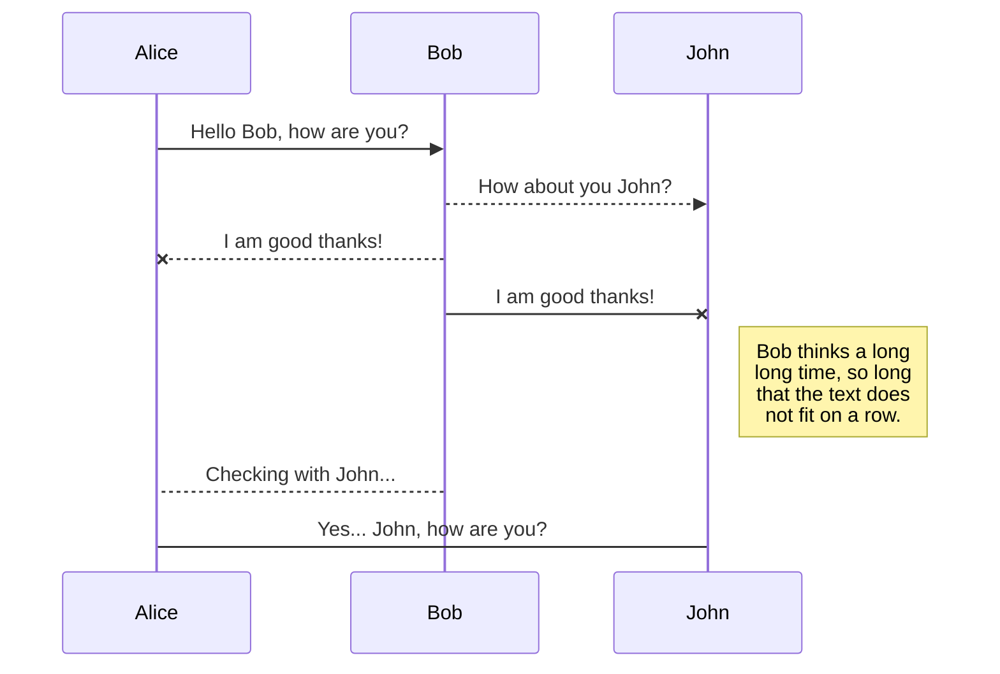

# RailsGilrsWithB
  
  
やりたいことリスト NOT TODO WISH LIST
- [ ] 改善案をまとめるアプリ
- [ ]
  
## uml
  
  

  

```
Error: ImageMagick is required to be installed to convert svg to png.
Error: Command failed: convert C:\Users\hidep\AppData\Local\Temp\mume-svg118930-38664-kl9bu8.4j2ss.svg C:\Users\hidep\dev\rails\objectbrain\assets\b32ae417280d3db9ef7dab343f26a5bc0.png
�����ȃp�����[�^�[�ł� - C:\Users\hidep\dev\rails\objectbrain\assets\b32ae417280d3db9ef7dab343f26a5bc0.png

```  

  